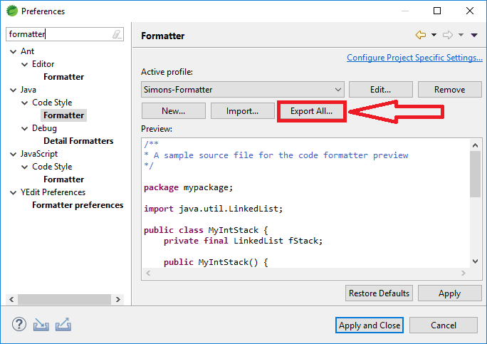

== Formatting Java Code Automatically

This repo is based on this article: http://www.mopri.de/2018/format-projects-java-code-git-hooks-finally-rid-annoying-ide-specifics/

Struggling with formatting issues when reviewing pull requests can be a pain.
Especially nowadays where members of the same teams use diffrent IDEs with different formatting setups. Having a commit hook in place, which handles formatting automatically solves this problem.

== Used technologies

* https://github.com/eirslett/frontend-maven-plugin (install npm dependencies -> husky and lint-staged)
* https://github.com/typicode/husky
* https://github.com/okonet/lint-staged
* https://github.com/diffplug/spotless/

== How to use

* Checkout the project
* Run `./mvnw compile` at least once to install node, npm and dependencies in the _package.json_ file.
* Modify the _JavaFormatterHookApplication.java_ file, but keep the weird formatting
* Do a `git add .` and `git commit -m "Testing husky commit hook"`
* Enjoy automatically formatted files 😊

The _simons-formatter-config.xml_ file, which is used by spotless, has been exported from the Eclipse IDE.

== Possible issues

=== Windows

* The _formatter.sh_ file must have unix line endings (Can be swiched by using Notepad++)

=== Ecipse EGit on Windows

To properly run the _formatter.sh_ script EGit needs cygwin (https://cygwin.com/install.html) to be installed.
And the _bin_ folder of the cygwin installation also has to be added to the path, e.g., _C:\cygwin64\bin_.

Also see https://www.eclipse.org/forums/index.php/t/1067404/

=== General issues

Commiting takes a little longer due to running the spotless maven goal, but IHMO it is worth it.

== Future tasks

For JavaScript/TypeScript projects it has become the default to make use of husky in conjunction with prettier.

For Java a Java Prettier project (https://github.com/jhipster/prettier-java) is under active development, which might be a nice alternative for running maven with spotless.

See prettier branch of this repo to see this working: https://github.com/SimonScholz/java-formatter-hook/tree/prettier

== Contributing

Please feel free to open an issue or give feedback.
